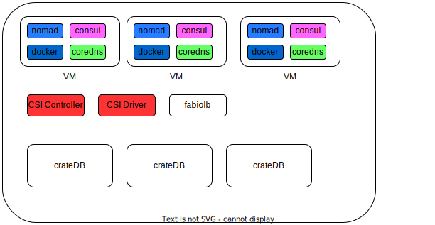

# Ansible Playbook to bootstrap nomad/consul

The `nomad.yaml` notebook bootstraps nomad and consul. You need to follow this steps **prior**
to run it:

- Create a bunch of VMs (at least 3) on your favorite Hosting Provider. Make sure you are
able to connect to them via SSH. As this is also used by ansible (we use root, but that
is configurable). Our favorite Hosting Provider is Hetzner. They have a CSI Plugin that also
works with nomad
- add a private network to the machine
- add the IP addresses to the ansible _inventory file_: [inventory.ini](../../inventory.ini)
- update the (Hetzner) Firewall Rules to allow [access to the Nomad Web UI](https://developer.hashicorp.com/nomad/tutorials/web-ui/web-ui-access) - in case you protect your servers with that - I always forget that :-)
- update the IP addresses to the ansible [group_vars/nomad.yaml](../../playbooks/group_vars/nomad.yaml)
- download the consul binary to your local machine. You need the binaries locally to generate the TLS keys. Which are copyied to your VMs by the runbook
- run `consul keygen` and add it to [group_vars/nomad.yaml](../../playbooks/group_vars/nomad.yaml)
- change directory to `playbooks/nomad/files` and create the TLS files required to bootstrap
consul. It is a bit of a shortcut, your mileage may vary:
    - `consul tls ca create`
    - `consul tls cert create -server -dc dc1 -domain consul`
- optionally run `boostrap`, which creates a _python env_ and installs the required python moduls
- source the python env
- run ansible and try to connect to your VMs eg.: `ANSIBLE_HOST_KEY_CHECKING=false ansible nomad -m ping`
- and for later: in case you want to try the Hetzner CSI plugin - create an API Key for that (for further details check the post installation tasks [here](../../nomad-consul-on-hetzner/README.md) )
